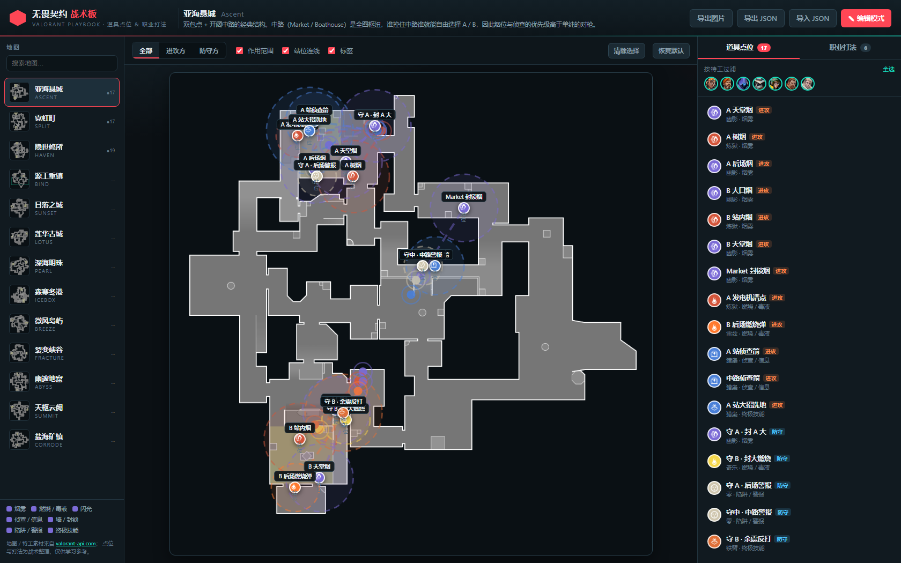

# 无畏契约 · 战术板（Valorant Playbook）

一个纯静态的《无畏契约》地图道具/战术部署网页：**选图 → 看点位 → 照着投**。
每张图都有进攻/防守两套道具点位（含「站哪 → 看哪 → 怎么投」的完整说明）和 5–6 套职业打法（阵容 + 时间轴 + 提示）。

### 🎯 直接在线使用：<https://chl191980.github.io/valorant-playbook/>



## 快速开始

```powershell
cd D:\dsh\valorant-playbook
node tools/serve.js            # 默认 http://127.0.0.1:8099/
```

浏览器打开 <http://127.0.0.1:8099/> 即可（纯前端，无构建步骤、无依赖）。
也可以直接双击 `index.html` 用 `file://` 打开，但部分浏览器会限制本地图片，建议用上面的本地服务器。

## 在线使用（GitHub Pages）

仓库已经按 GitHub Pages 的静态托管要求准备好：根目录就是站点根，**没有构建步骤**。

- 线上地址：**<https://chl191980.github.io/valorant-playbook/>**（已开启 Pages，源 = `main` 分支 `/`）
- 纯静态，图片和 13 张地图都是相对路径，无需任何配置。
- `.nojekyll` 已就位（否则 Jekyll 会忽略 `_grid/`、`_shot/` 这类下划线开头的目录）。

Fork 到自己的账号后，把仓库 Settings → Pages 的 Source 设为 `main` / `/`，即可得到 `https://<你的用户名>.github.io/valorant-playbook/`。

### 怎么一起改点位？

点位数据就是普通的 `data/tactics/<slug>.js` 文件，所以**标准 PR 流程就是协作方式**：改文件 → 跑 `validate.js` + `voidcheck.js` → 提 PR → 合并后 Pages 自动重新部署，所有人刷新即见。详见 [CONTRIBUTING.md](CONTRIBUTING.md)。

网页里的「编辑模式」是**每个人自己浏览器**的本地草稿（存在 localStorage），导出 JSON 后可以贴到 Issue 里请人合进源数据。

## 功能

| 功能 | 说明 |
| --- | --- |
| 地图列表 | 左侧 13 张战术图，带搜索框，缩略图右上角显示该图点位数 |
| 进攻 / 防守筛选 | 顶部三段按钮，一键只看进攻方或防守方的道具 |
| 范围圈 / 站位连线 / 标签 | 三个开关。范围圈按道具类型给出烟、燃烧、闪光的实际覆盖半径；连线从你的站位指向道具落点 |
| 特工过滤 | 右侧头像行，点一下隐藏该特工的所有点位（例如只想看烟雾位） |
| 职业打法 | 「职业打法」标签页，每图 5–6 套。点标题展开时间轴步骤，并**在地图上高亮该套路用到的点位**，其余点位自动变暗 |
| 地名 | 「地名」开关，把官方 Wiki 的 callout（A 天堂 / B 隧道 / 中路木门…）叠在地图上；没有该图地名数据时开关会自动隐藏，不会出现死按钮 |
| 编辑模式 | 右上角「编辑模式」：点空白处新增点位、拖动点位改坐标、Delete 删除、调色板选特工与道具类型 |
| 持久化 | 你的改动存在浏览器 localStorage，刷新不丢 |
| 导出 / 导入 JSON | 把自定义点位与位置微调导出成文件，换电脑导入即可 |
| 导出图片 | 把当前地图 + 全部点位 + 范围圈 + 站位连线渲染成 1500×1500 PNG，可发群里 |

## 目录结构

```
valorant-playbook/
├─ index.html            页面骨架
├─ styles.css            暗色电竞风样式
├─ app.js                全部交互逻辑（无依赖 IIFE）
├─ assets/
│  ├─ maps/<slug>.png    13 张官方小地图
│  ├─ agents/<slug>.png  29 张特工头像
│  └─ abilities/…        118 张技能图标
├─ data/
│  ├─ core.js            window.CORE = { maps, agents }
│  ├─ maps.json          地图元数据（含 uuid / 中英文名）
│  ├─ agents.json        特工元数据（中英文名 / 定位 / 技能）
│  ├─ SCHEMA.md          点位数据规范（改数据前必读）
│  ├─ callouts.json      官方 Wiki 地名坐标（原始数据）
│  ├─ callouts.js        由上者编译出的 window.CALLOUTS
│  └─ tactics/<slug>.js  13 个战术数据文件
├─ tools/
│  ├─ serve.js           本地静态服务器
│  ├─ build-core.js      由 maps.json / agents.json 生成 data/core.js
│  ├─ build-callouts.js  由 callouts.json 生成 data/callouts.js（顺带配中文名）
│  ├─ validate.js        战术数据校验器（字段/数量/引用关系）
│  ├─ voidcheck.js       可走地面自检：点位是否落在墙体/虚空里
│  ├─ nudge.js           按补丁批量微调坐标（保留排版）
│  ├─ mirrorx.js         水平镜像整张图的横坐标 / 翻转文案方位词（修「A/B 左右对调」）
│  ├─ sitecheck.js       用下包区色块质心核对每图 A/B 包点方位
│  ├─ sideaudit.js       检查点位标签的自称阵营与 Wiki 地名聚类是否一致
│  ├─ shoot.js           无头 Chrome 截图 / 控制台错误检测
│  └─ recover.js         从对话记录里恢复被误删的文件
├─ _grid/<slug>_grid.png 叠加 10% 网格的小地图（写坐标时的标尺）
└─ _shot/                无头验证产物：contact.html 是 13 图点位总览 QC 页，home.png 是 README 用的界面截图
```

## 数据规模

13 张图 · **209 个道具点位**（进攻 140 / 防守 69）· **67 套职业打法**（进攻 39 / 防守 28）。
每张图 15–19 个点位、5–6 套打法，全部通过 `validate.js` 与 `voidcheck.js` 双重校验。


## 自己加点位 / 改坐标

最简单的方式是**用网页的编辑模式**，改完导出 JSON 备份。

如果要改源数据，请先读 `data/SCHEMA.md`：

```powershell
node tools/validate.js            # 校验全部地图
node tools/validate.js ascent     # 只校验一张图
```

校验器会检查：特工/道具/阵营取值是否合法、坐标是否越界、每图 markers ≥ 12、strats ≥ 4、阵容是否够 5 人、打法的 `marks` 是否引用了真实存在的点位。

坐标一律是**小地图百分比**（左上角为原点，0–100）。写新坐标时对着 `_grid/<slug>_grid.png` 看，橄榄色方块就是下包区。

`data/callouts.json` 是按官方 Wiki 交互地图的 callout 坐标整理出来的原始数据（已从 Wiki 的「左下原点、0–1024/2048」换算成同一套百分比坐标系），**13 张图共 352 个地名**。改完跑 `node tools/build-callouts.js` 重新编译即可（脚本会按内置术语表给英文 callout 配中文名）。

```powershell
node tools/build-callouts.js     # 由 callouts.json 生成 data/callouts.js（顺带按术语表配中文名）
```

### 检查点位有没有落进墙里

`node tools/validate.js` 只查数据规范，查不出「坐标写得合法但落在虚空里」。用：

```powershell
node tools/voidcheck.js              # 全部地图
node tools/voidcheck.js ascent       # 只查一张图
node tools/voidcheck.js --patch tools/_fix.json   # 顺便生成修正补丁
```

它用内置的 PNG 解码器读出小地图的 alpha 通道，做一次距离变换，报告每个落点/站位离最近可走地面有多远；超过 0.35% 图宽就判为越界并给出建议坐标。生成的补丁直接喂给 `nudge.js` 即可：

```powershell
node tools/voidcheck.js --patch tools/_fix.json
node tools/nudge.js tools/_fix.json
```

### 微调坐标

`tools/nudge.js` 可以按补丁精确改坐标而不打乱原文件排版：

```json
{
  "ascent": {
    "a-main-smoke": { "pt": [37.2, 8.7] },
    "a-site-molly": { "from": [45.4, 13.0] }
  }
}
```

```powershell
node tools/nudge.js tools/_patch.json
node tools/validate.js ascent
```

## 无头验证

`tools/shoot.js` 用 CDP 驱动无头 Chrome，可以截图并抓取控制台异常，适合改完前端后自查：

```powershell
node tools/shoot.js _shot/home.png --w 1680 --h 1050
node tools/shoot.js _shot/strats.png --seq 's1200|c#tabs button[data-tab="strats"]|s400|c.strat h4|s700' `
     --js "document.querySelectorAll('#markers .mk.hl').length"
```

**注意**：`c` 后面跟的是 CSS 选择器（不是 JS），`e` 后面跟 JS 表达式；两者用 `|` 分隔。

## 素材与免责声明

- 地图小地图、特工头像、技能图标、地图与特工元数据：<https://valorant-api.com>
- 点位坐标与打法整理：参考官方交互地图 callout、ValoHub 等公开资料，再由本项目逐图核对到可走地面上。

本项目是**非官方、非商业的粉丝向参考资料**，与 Riot Games 无任何隶属或背书关系。
`assets/` 下的游戏美术素材版权归 **Riot Games, Inc.** 所有，此处仅用于呈现本资料，请勿用于商业用途。
代码与整理出的点位/打法数据以 MIT 许可发布（见 [LICENSE](LICENSE)）。

> This is an unofficial fan-made reference. Game assets under `assets/` are
> property of Riot Games, Inc. and are used here for non-commercial reference
> only. Valorant is a trademark of Riot Games, Inc. This project is not
> endorsed by or affiliated with Riot Games.

## 已收录地图

亚海悬城 Ascent · 霓虹町 Split · 隐世修所 Haven · 源工重镇 Bind · 日落之城 Sunset · 莲华古城 Lotus · 深海明珠 Pearl · 森寒冬港 Icebox · 微风岛屿 Breeze · 裂变峡谷 Fracture · 幽邃地窟 Abyss · 天枢云阙 Summit · 盐海矿镇 Corrode
